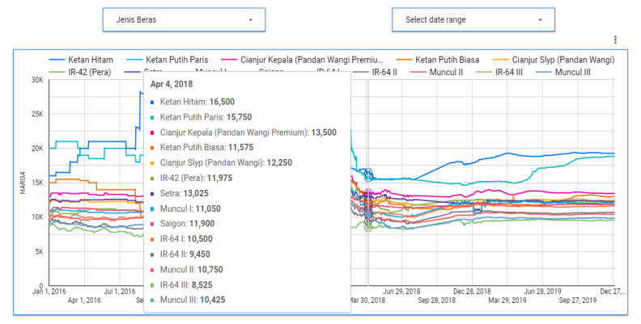
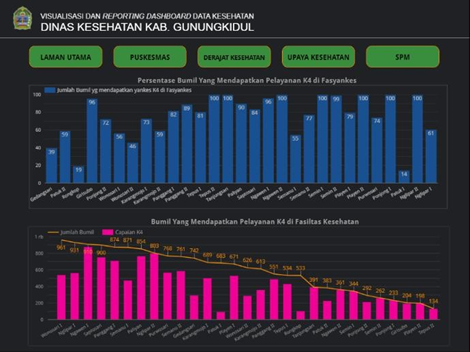

# Tugas VDI Pertemuan 2
**Nama     : Deva Anjani Khayyuninafsyah**\
**NIM      : 122450014**\
**Kelas    : RB**

# **Visualization Design Objective: Key Principles**
1. Strive for forms and functions (bentuk dan fungsi yang tepat)
2. Justifying the selection of everything we do (pembenaran dalam pemilihan desain)
3. Creating accessibility through intuitive design (menciptakan aksesibilitas melalui desain yang intuitif)
4. Never decieve the receiver (tidak menyesatkan)

# **Good or Bad Viz?**
## **Gambar Pertama: Grafik Pie Chart Kasus Berdasarkan Kabupaten**

*Sumber: https://dcckotabumi.ac.id/ojs/index.php/jik/article/download/347/275*
1. Visualisasi ini menampilkan data “Sembuh”, “Meninggal”, dan “Terkonfirmasi”. Bentuk diagram seperti pada gambar sering kali lebih sulit untuk dipahami dibandingkan dengan diagram batang ataupun diagram garis ketika perbedaan antar segmen kecil. Jadi, gambar di atas **tidak cukup memenuhi** prinsip strive for forms and functions (bentuk dan fungsi yang tepat).
2. Pemilihan warna yang berbeda untuk tiap data tentu dibenarkan. Akan tetapi, masih terdapat warna-warna yang terlihat mirip sehingga dapat membingungkan. Sebaiknya, warna-warna tersebut dibuat lebih kontras lagi agar data lebih mudah untuk dibedakan. Jadi, gambar di atas **tidak cukup memenuhi** prinsip justifying the selection of everything we do (pembenaran dalam pemilihan desain).
3. Informasi yang diberikan sudah cukup jelas, tetapi ukuran persentase atau angka sebenarnya tidak terlalu besar sehingga menjadi sulit dibaca bila visualisasi ditampilkan dengan ukuran kecil seperti itu. Mungkin jika diberi petunjuk tambahan yang lebih detail maka kebingungan dalam memahami data bisa teratasi. Jadi, gambar di atas **tidak cukup memenuhi** prinsip creating accessibility through intuitive design (menciptakan aksesibilitas melalui desain yang intuitif).
4. Untuk grafik bagian data “Sembuh” dan “Terkonfirmasi” di Kota Bekasi terlihat sama saja padahal persentase keduanya berbeda, yaitu 26.1% dan 24.7%. Ditambah lagi, informasi yang diberikan bahwa grafik yang digunakan adalah Pie Chart padahal sebenarnya grafik tersebut adalah Donut Chart. Hal ini dapat menyesatkan pembaca sehingga gambar ini **tidak memenuhi** prinsip never decieve the receiver (tidak menyesatkan).

## **Gambar Kedua: Perbandingan Indikator Penyakit**

*Sumber: https://e-journals2.unmul.ac.id/index.php/kretisi/article/view/447/258*
1. Bentuk visualisasi diagram batang berbentuk horizontal bertumpuk sudah sangat sesuai untuk menyajikan perbandingan antar kelompok data selama 2020 hingga 2021. Diagram ini memudahkan pembaca dalam membandingkan ukuran tiap kategori sehingga jelas bahwa diagram ini menampilkan perubahan angka kasus dalam dua tahun dengan tiap kategori penyakit. Jadi, gambar ini **memenuhi** prinsip strive for forms and functions (bentuk dan fungsi yang tepat).
2. Pemilihan warna jelas, konsisten, dan logis di mana tiap warna merujuk pada kategori penyakit yang berbeda. Ukuran batang pun proporsional dengan data yang ditampilkan, ditambah lagi angka kasus yang langsung ditampilkan pada batang. Jadi, gambar ini **memenuhi** prinsip justifying the selection of everything we do (pembenaran dalam pemilihan desain) karena data mudah dipahami tanpa harus menghitung ulang skala.
3. Diagram ini menggunakan desain yang intuitif dengan warna, label angka, dan skala horizontal yang memperjelas perbandingan antar kategori. Dari diagram ini terlihat jelas tren dari tahun ke tahun. Jadi, gambar ini **memenuhi** prinsip creating accessibility through intuitive design (menciptakan aksesibilitas melalui desain yang intuitif).
4. Pada diagram tersebut, seluruh kategori penyakit diwakili dengan ukuran dan warna yang sesuai. Data tahun 2020 hingga 2021 pun dibuat berdampingan. Hal ini berarti informasi diberikan dengan transparan sehinggga tidak ada risiko kesalahan dalam interpretasinya. Jadi, gambar ini **memenuhi** prinsip never decieve the receiver (tidak menyesatkan).

## **Gambar Ketiga: Tampilan Grafik Deret Waktu di Google Data Studio**

*Sumber: https://r.search.yahoo.com/_ylt=AwrKAjhrI_Vm96gKeYLLQwx.;_ylu=Y29sbwNzZzMEcG9zAzMEdnRpZAMEc2VjA3Ny/RV=2/RE=1727370220/RO=10/RU=https%3a%2f%2fjournal.ipb.ac.id%2findex.php%2fjurnaltin%2farticle%2fdownload%2f35857%2f21891/RK=2/RS=zzWjZ58BJv.MLEXZlZg_4xBRIAU-*
1. Visualisasi ini sudah tepat untuk menjelaskan tren deret waktu. Grafik yang dipilih sudah mampu menampilkan hubungan temporal dan membandingkan beberapa kategori beras dengan baik. Jadi, gambar ini **memenuhi** prinsip strive for forms and functions (bentuk dan fungsi yang tepat).
2. Grafik yang dipilih memang sudah tepat, tetapi terdapat kemungkinan kekacauan visual. Kekacauan yang dimaksud, yaitu kesulitan dalam membaca grafik tersebut karena terlalu banyak garis dan warna yang digunakan bahkan warnanya hampir mirip. Selain itu, dengan banyaknya warna yang digunakan membuat sulit untuk fokus pada satu kategori. Jadi, gambar ini **tidak cukup memenuhi** prinsip justifying the selection of everything we do (pembenaran dalam pemilihan desain).
3. Banyaknya garis dan warna pada grafik membuat hasil visualisasinya terlalu padat sehingga pembaca akan kesulitan untuk memahami informasi. Banyak sekali kategori yang ditampilkan secara bersamaan juga dapat membingungkan, apalagi terdapat garis-garis yang saling tumpang tindih. Jadi, gambar ini **tidak memenuhi** prinsip creating accessibility through intuitive design (menciptakan aksesibilitas melalui desain yang intuitif).
4. Pada grafik ini tidak ada indikasi informasi yang menyesatkan. Data-data ditampilkan dengan skala yang konsisten sehingga informasi tentang perubahan harga beras dari waktu ke waktu menjadi akurat. Dengan begitu, gambar ini **memenuhi** prinsip never decieve the receiver (tidak menyesatkan).

## **Gambar Keempat: Reporting Visualisasi Pelayanan Kesehatan Ibu Hamil (SPM1)**

*Sumber: https://journal.ugm.ac.id/jisph/article/view/72260*
1. Grafik pada gambar tersebut menampilkan perbandingan jumlah ibu hamil yang mendapat layanan K4 di fasyankes dan fasilitas kesehatan. Warna yang digunakan juga cukup kontras sehingga memberikan perbedaan yang jelas. Jadi, grafik tersebut **memenuhi** prinsip strive for forms and functions (bentuk dan fungsi yang tepat).
2. Dengan memilih desain berupa grafik batang dan grafik baris, kolaborasi tersebut membuat pembaca lebih mudah dalam membandingkan data numerik dari jumlah ibu hamil dengan target atau tren. Sehingga, grafik ini **memenuhi** prinsip justifying the selection of everything we do (pembenaran dalam pemilihan desain).
3. Visualisasi dari grafik tersebut cukup mudah dipahami karena menggabungkan grafik batang dan grafik garis dengan tujuan yang jelas. Selain itu, label angka yang digunakan sudah cukup jelas sehingga memudahkan pembaca dalam memahami informasi yang ingin disampaikan melalui grafik tersebut. Oleh karena itu, grafik tersebut **memenuhi** prinsip creating accessibility through intuitive design (menciptakan aksesibilitas melalui desain yang intuitif).
4. Informasi yang divisualisasikan melalui grafik tersebut juga tidak memiliki unsur yang menyesatkan, terutama dari sisi data. Data jumlah dan cakupan pelayanan ditampilkan tanpa ada distorsi dalam penyajian grafik sehingga terlihat bahwa data ditampilkan dengan jujur. Jadi, grafik tersebut juga **memenuhi** prinsip never decieve the receiver (tidak menyesatkan).

## **Kesimpulan**
Gambar yang termasuk visualisasi baik, yaitu Gambar Kedua dan Gambar Keempat.
Gambar yang termasuk visualisasi buruk, yaitu Gambar Pertama dan Gambar Ketiga.
Visualisasi yang baik adalah visualisasi yang memenuhi keempat key principles. Apabila satu saja tidak terpenuhi, maka visualisasi tersebut dapat digolongkan sebagai visualisasi yang buruk.