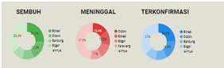
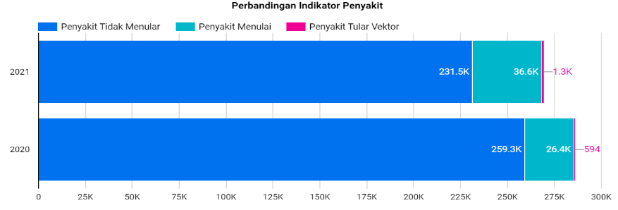

# Tugas VDI Pertemuan 2
**Nama     : Deva Anjani Khayyuninafsyah**\
**NIM      : 122450014**\
**Kelas    : RB**

# **Visualization Design Objective: Key Principles**
1. Strive for forms and functions (bentuk dan fungsi yang tepat)
2. Justifying the selection of everything we do (pembenaran pilihan desain)
3. Creating accessibility through intuitive design (menciptakan aksesibilitas melalui desain yang intuitif)
4. Never decieve the receiver (tidak menyesatkan)

# **Good or Bad Viz?**
## **Gambar Pertama: Grafik Pie Chart Kasus Berdasarkan Kabupaten**

*Sumber: https://dcckotabumi.ac.id/ojs/index.php/jik/article/download/347/275*
1. Visualisasi ini menampilkan data “Sembuh”, “Meninggal”, dan “Terkonfirmasi”. Bentuk diagram seperti pada gambar sering kali lebih sulit untuk dipahami dibandingkan dengan diagram batang ataupun diagram garis ketika perbedaan antar segmen kecil. Jadi, gambar di atas **tidak cukup memenuhi** prinsip strive for forms and functions (bentuk dan fungsi yang tepat).
2. Pemilihan warna yang berbeda untuk tiap data tentu dibenarkan. Akan tetapi, masih terdapat warna-warna yang terlihat mirip sehingga dapat membingungkan. Sebaiknya, warna-warna tersebut dibuat lebih kontras lagi agar data lebih mudah untuk dibedakan. Jadi, gambar di atas **tidak cukup memenuhi** prinsip justifying the selection of everything we do (pembenaran pilihan desain).
3. Informasi yang diberikan sudah cukup jelas, tetapi ukuran persentase atau angka sebenarnya tidak terlalu besar sehingga menjadi sulit dibaca bila visualisasi ditampilkan dengan ukuran kecil seperti itu. Mungkin jika diberi petunjuk tambahan yang lebih detail maka kebingungan dalam memahami data bisa teratasi. Jadi, gambar di atas **tidak cukup memenuhi** prinsip creating accessibility through intuitive design (menciptakan aksesibilitas melalui desain yang intuitif).
4. Untuk grafik bagian data “Sembuh” dan “Terkonfirmasi” di Kota Bekasi terlihat sama saja padahal persentase keduanya berbeda, yaitu 26.1% dan 24.7%. Ditambah lagi, informasi yang diberikan bahwa grafik yang digunakan adalah Pie Chart padahal sebenarnya grafik tersebut adalah Donut Chart. Hal ini dapat menyesatkan pembaca sehingga gambar ini **tidak memenuhi** prinsip never decieve the receiver (tidak menyesatkan).

## **Gambar Kedua: Perbandingan Indikator Penyakit**

*Sumber: https://e-journals2.unmul.ac.id/index.php/kretisi/article/view/447/258*
1. Bentuk visualisasi diagram batang berbentuk horizontal bertumpuk sudah sangat sesuai untuk menyajikan perbandingan antar kelompok data selama 2020 hingga 2021. Diagram ini memudahkan pembaca dalam membandingkan ukuran tiap kategori sehingga jelas bahwa diagram ini menampilkan perubahan angka kasus dalam dua tahun dengan tiap kategori penyakit. Jadi, gambar ini **memenuhi** prinsip strive for forms and functions (bentuk dan fungsi yang tepat).
2. Pemilihan warna jelas, konsisten, dan logis di mana tiap warna merujuk pada kategori penyakit yang berbeda. Ukuran batang pun proporsional dengan data yang ditampilkan, ditambah lagi angka kasus yang langsung ditampilkan pada batang. Jadi, gambar ini **memenuhi** prinsip justifying the selection of everything we do (pembenaran pilihan desain) karena data mudah dipahami tanpa harus menghitung ulang skala.
3. Diagram ini menggunakan desain yang intuitif dengan warna, label angka, dan skala horizontal yang memperjelas perbandingan antar kategori. Dari diagram ini terlihat jelas tren dari tahun ke tahun. Jadi, gambar ini **memenuhi** prinsip creating accessibility through intuitive design (menciptakan aksesibilitas melalui desain yang intuitif).
4. Pada diagram tersebut, seluruh kategori penyakit diwakili dengan ukuran dan warna yang sesuai. Data tahun 2020 hingga 2021 pun dibuat berdampingan. Hal ini berarti informasi diberikan dengan transparan sehinggga tidak ada risiko kesalahan dalam interpretasinya. Jadi, gambar ini **memenuhi** prinsip never decieve the receiver (tidak menyesatkan).